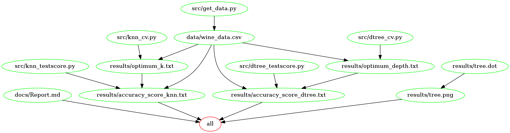

## Objectives

The aim of this project is to practice best practices in data science workflows as well as some newly-acquired supervised machine learning techniques. 

In this project, I implement the k-nearest neighbours algorithm and the decision tree algorithm on the [Wine Data Set](https://archive.ics.uci.edu/ml/datasets/wine). In the end, I get the accuracy score of both algorithms when predicting the type of wine for a new  input. 

I present the accuracy scores as percentages. I am interested in whether there will be a dramatic difference in the accuracy scores of these algorithms and if there is, which one will be higher.


## Data

The data used in this project is from [UC Irvine Machine Learning Repository](https://archive.ics.uci.edu/ml/index.php). It consists of 178 observations, 13 attributes and 3 classes of wine.

The data is also available in current repository as [wine_data.csv](data/wine_data.csv).


## System Requirements

* Python 3.6.1 and packages:
	* scikit-learn==0.18.1
	* pandas==0.20.1
	* numpy==1.12.1
	* argparse==1.4.0
	* matplotlib==2.0.2

## Dependency Diagram




## Reproducing the Analysis

```
docker pull nazliozum/wine_classification
```

```

```

3) Run the following command on the command line to download the data.

```
make all
```

Run the following commands in order to reproduce the analysis.


## Author

Nazli Ozum Kafaee