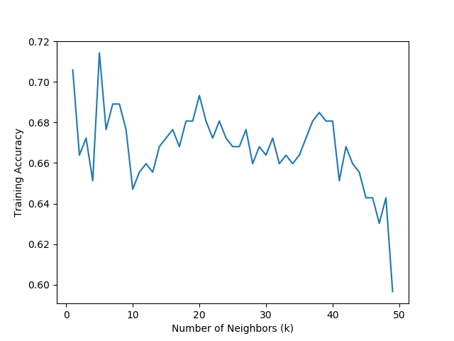
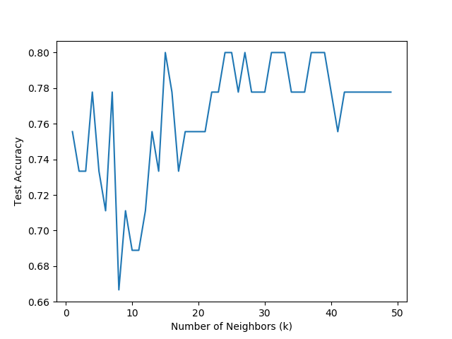
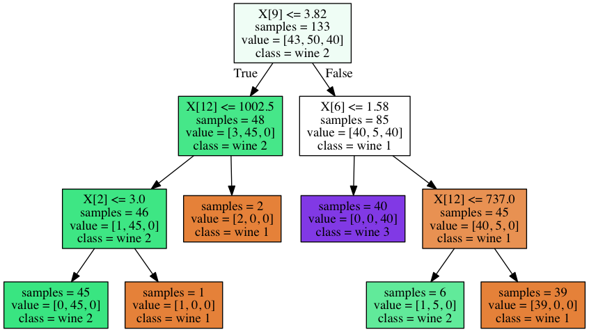
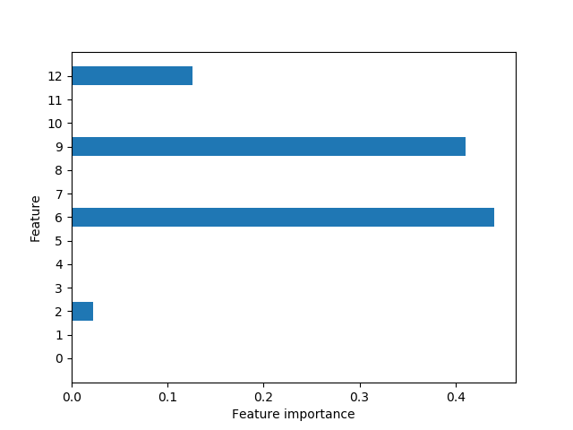

# A Comparison between Knn and Decision Tree

In supervised learning, our aim is to build a model using the training data and then be able to make accurate predictions on new and unseen data that has the same characteristics as the training data. In order to make accurate predictions, our model should generalize well. This would mean controlling for model complexity and avoiding both overfitting and underfitting the model to training data. 

In this project, I have implemented the K-Nearest Neighbours Model and Decision Tree Model on a small data set called [Wine Data Set](https://archive.ics.uci.edu/ml/datasets/wine) from the [UCI Machine Learning Repository](https://archive.ics.uci.edu/ml/index.php). I examine the differences of accuracy both models yield on the test set. In order to control for model complexity and get the best predictions out of both models, I optimize k-value for K-nearest Neighbours and tree depth for the Decision Tree.

## The Wine Data Set

The data are the results of a chemical analysis of wines grown in the same region in Italy but derived from three different cultivars. The analysis determined the quantities of 13 constituents found in each of the three types of wines. 

There are 59 instances of class 1, 71 of class 2, and 48 of class 3. There are 13 attributes which are:

1) Alcohol  
2) Malic acid  
3) Ash  
4) Alcalinity of ash    
5) Magnesium  
6) Total phenols  
7) Flavanoids  
8) Nonflavanoid phenols  
9) Proanthocyanins  
10) Color intensity  
11) Hue  
12) OD280/OD315 of diluted wines  
13) Proline  

All atributes are continuous and there aren't any missing attributes.

## K-Nearest Neighbours

In the KNN algorithm, I tried to choose the best k-value, i.e. the number of neighbours to consider through cross validation. The analysis determine 5 to be the k-value that gives the highest accuracy score in validation data. The change in training accuracy with regards to k-value can be seen below clearly with the max value corresponding to __k = 5__.

With 5 as my k-value, I applied the model to test data to get a test accuracy score. The result was 0.73. This communicates that my k-nearest neighbours model predicts the correct wine label __73%__ of the time.

Just to see if we had really chosen a good k-value, we can plot test accuracy versus k-values. The plot below shows that k-values other than 5 actually yield more test accuracy than k = 5. However, of course we cannot change our model based on test accuracy. We fit our model to the training data set and get the final accuracy on test data. The plot below is just out of curiosity.

## Decision Tree

There are two common strategies to prevent overfitting: stopping the creation of the tree early (pre-pruning), or building the tree but then removing or collapsing nodes that contain little information (also called post-pruning or just pruning). Possible criteria for pre-pruning include limiting the maximum depth of the tree, limiting the maximum number of leaves, or requiring a minimum number of points in a node to keep splitting it.

In my analysis, I controlled for the maximum depth of the tree and found __3 to be the optimum depth__ giving the highest trainin accuracy score through cross validation. The visualization of the decision tree with depth 3 can be seen below.

By looking at the feature importances in the model, we can see that sixth, nineth and twelveth attributes which are "Total phenols", "Proanthocyanins" and "OD280/OD315 of diluted wines" repectively are the most important features in our model. The second attribute which is "Malic acid" is also important but less than the other three. In the model with depth 3, no other attribute gives any information for a meaningful split.

The test accuracy of the decision tree with depth 3 is 0.93 meaning this algorithm would predict the right wine class __93%__ of the time.

# Conclusion
My analysis concludes that the decision tree yields a highly better accuracy score compared to the knn algorithm given I have implemented the same logical structure within the two approaches. 

# Resources

- [An Introduction to Machine Learning with Python](https://www.safaribooksonline.com/library/view/introduction-to-machine/9781449369880/) by Andreas C. Müller and Sarah Guido (O’Reilly). Copyright 2017 Sarah Guido and Andreas Müller, 978-1-449-36941-5.

- [scikit-learn](http://scikit-learn.org/stable/index.html)
